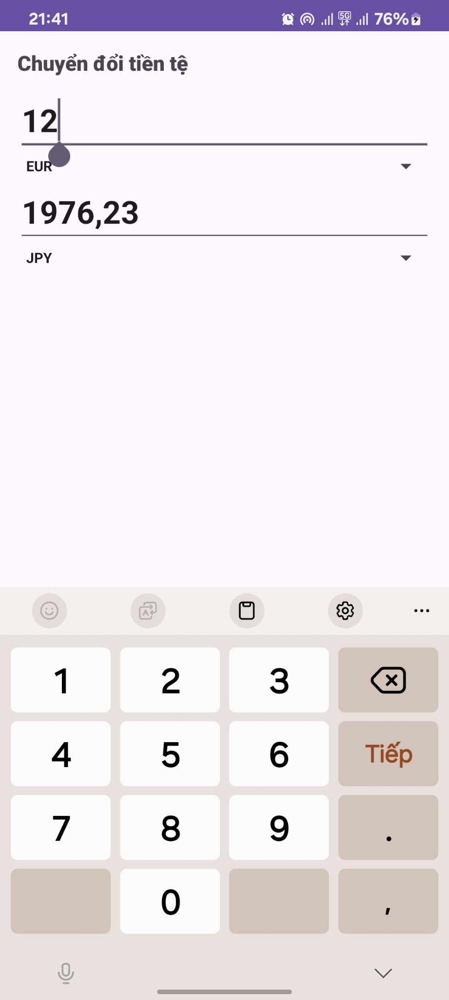

# Currency Converter App

Ứng dụng Currency Converter cho phép người dùng chuyển đổi giữa các loại tiền tệ khác nhau một cách dễ dàng và nhanh chóng. Ứng dụng sử dụng tỷ giá hối đoái để thực hiện phép chuyển đổi.

## Tính năng

- Chọn loại tiền tệ nguồn và đích.
- Nhập số tiền cần chuyển đổi.
- Tự động tính toán và hiển thị kết quả.
- Hỗ trợ nhiều loại tiền tệ khác nhau.

## Screenshots

